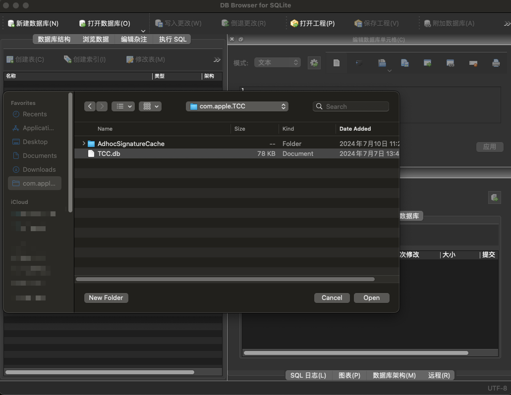
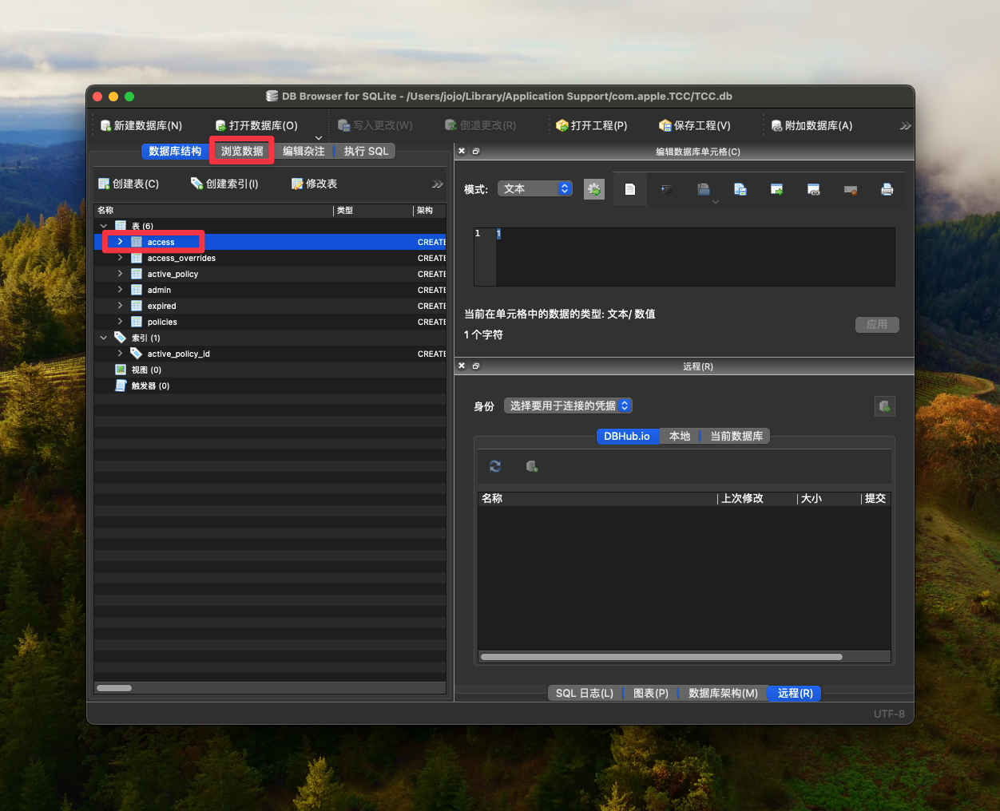
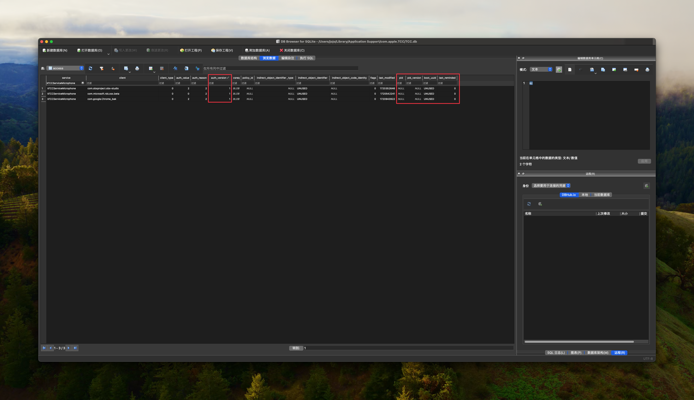
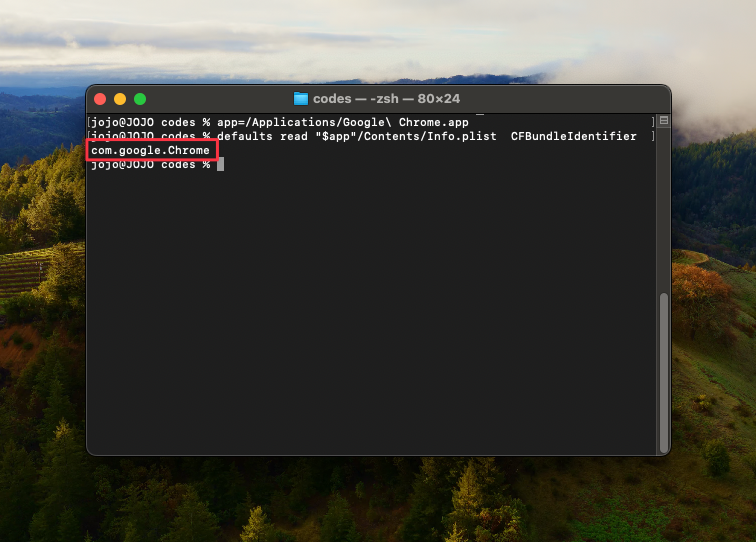
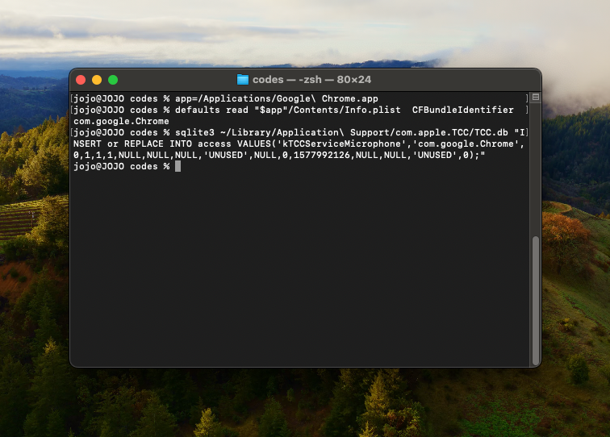
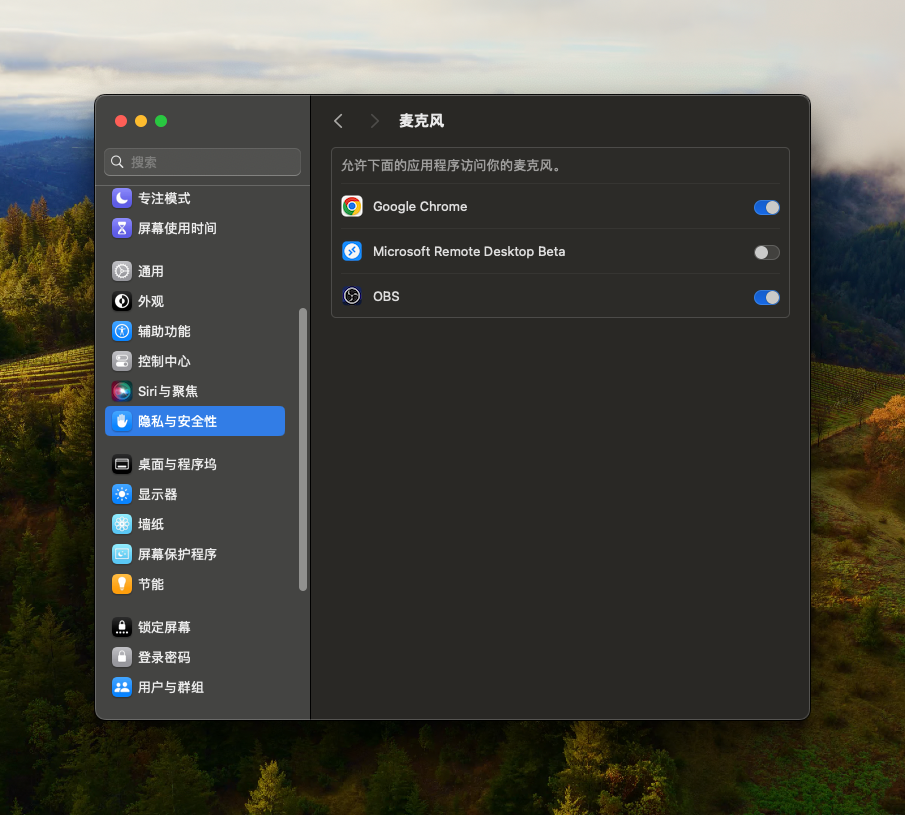
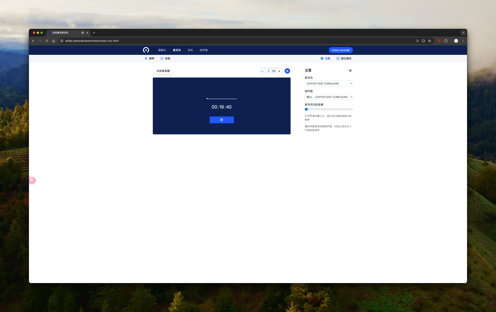

## 一、问题描述
本人是黑苹果，当然这个问题在苹果店内使用白苹果测试也有概率触发，触发条件未知，概率比较高，很玄学。

当电脑安装了Chrome、微信等应用，需要使用麦克风、摄像头时，因为Mac系统严格的权限管理机制，需要向用户申请权限后，退出应用重启才能使用。

正常情况下触发权限申请时，会直接弹窗到设置页面，请求用户开启权限。但是这个异常情况，弹出的窗口内并没有对应的应用，也没有添加按钮，无法给某个应用设置权限。

注意右上角的`麦克风已关闭`，这里点击后会引导到设置窗口，在设置窗口找不到该应用的名字（如图）

这种情况下就无法给应用配置权限。

## 二、问题分析
经过一些资料查询，在 Apple Support 官网找到了如下的帖子：
[https://discussionschinese.apple.com/thread/250882614](https://discussionschinese.apple.com/thread/250882614)

> 1 禁止SIP
> 重启动Mac，并按住comman+r，进入恢复模式后，打开终端(Terminal)程序，运行命令：
> ```
> csrutil disable
> ```
> 重新启动
> 
> 2 运行命令行
> 依次运行下面三行命令：
> ```
> sudo sqlite3 ~/Library/Application\ Support/com.apple.TCC/TCC.db "INSERT or REPLACE INTO access VALUES('kTCCServiceMicrophone','com.valvesoftware.steam',0,1,1,NULL,NULL,NULL,'UNUSED',NULL,0,1577992126);"
> ```
> ```
> /usr/libexec/PlistBuddy -c "Add NSMicrophoneUsageDescription string" /Applications/Steam.app/Contents/Info.plist
> ```
> ```
> /usr/libexec/PlistBuddy -c "Set :NSMicrophoneUsageDescription Using voice chat" /Applications/Steam.app/Contents/Info.plist
> ```
> 
> 3 打开SIP 
> 重启动Mac，并按住comman+r，进入恢复模式后，打开终端(Terminal)程序，运行命令： 
> ```
> csrutil enable
> ```
> 重新启动

但是直接使用答主给的指令，会遇到类似如下的报错：


因为对SQL有所了解，所以能看懂这个错误，并且可以尝试解决。先说下错误的原因：
这个表需要17个字段（不同版本字段数不一样，以自己的为准），但是指令只传进去了12个字段，所以会报错。从这里也能看出来，apple在旧版本的Mac中，这个表只有12个字段的，后续的更新中，增加了一部分字段，导致这条数据无法插入数据库中。
原因知道了，我们现在只需要看看表的结构，可以尝试补充剩余的几个字段。首先我们要先打开数据库，看看正常的数据都是什么样的。
这里我选择使用了[DB Browser for SQLite](https://sqlitebrowser.org/dl/)，可以直接打开数据库，直观的看到数据结构。

打开应用后，选择左上角的`打开数据库`按钮，接着找到这个目录的文件`~/Library/Application Support/com.apple.TCC/TCC.db`，点击打开即可。

如果你在弹出的访达窗口找不到这个目录，可以右键访达应用，选择`前往文件夹`，然后输入以下内容`~/Library/Application Support/`，点击回车后在当前目录下找到`com.apple.TCC`目录，将其拖拽到左侧的收藏夹中，这样就能在弹出的窗口中快速打开这个目录了。

打开数据库文件后，我们找到并点击`assess`表，然后再点击上方的浏览数据，我们就能看到整个表的数据内容了。


看到数据后再对比上面答主提到的指令，我们会发现，新增的字段是后面4个和前面1个，这里不知道旧系统的字段什么样，只能猜测新增的字段是以下五个：


不管怎么说，我们现在已经知道表的结构了，可是照猫画虎试试能不能行，然后就行了。

## 三、解决方案
根据前文的分析，我们尝试将数据插入表中能不能行。
首先参考上文答主给的指令，我们打开终端，对其进行修改后执行（使用上文提到的[DB Browser for SQLite](https://sqlitebrowser.org/dl/)可能更方便操作一些）：

### 1. 关闭SIP
重新启动Mac，按住command+r，进入恢复模式后（黑苹果用自己的方法进入），打开终端(Terminal)程序，运行命令：
```bash
csrutil disable
```
执行完之后重启正常进入系统。

### 2. 运行指令
首先获取需要增加权限应用的包名：
打开终端(Terminal)程序，同时打开访达窗口，找到应用程序目录。
在终端窗口输入：
```bash
app=
```
然后将要增加权限的应用拖拽到终端窗口中，按下回车后，接着输入：
```bash
defaults read "$app"/Contents/Info.plist  CFBundleIdentifier
```
回车后就会在终端窗口中显示应用的包名（如图圈中部分）。


获取到包名后，我们将其复制剪切板备用。

接着打开终端(Terminal)程序，修改SQL指令，运行命令(注意把下文中的`com.google.Chrome`替换成你刚才获取到的包名)：
```bash
sqlite3 ~/Library/Application\ Support/com.apple.TCC/TCC.db "INSERT or REPLACE INTO access VALUES('kTCCServiceMicrophone','com.google.Chrome',0,1,1,1,NULL,NULL,NULL,'UNUSED',NULL,0,1577992126,NULL,NULL,'UNUSED',0);"
```


如果正常执行的话，这里是不会显示内容的，执行失败会输出错误信息。

执行完之后，我们把目标应用关闭，并且将设置关闭（注意右键关闭，不要将其保留在后台）。

~~当然这个操作在[DB Browser for SQLite](https://sqlitebrowser.org/dl/)软件内操作会更方便，这里不过多介绍了，都是中文界面，自行研究。~~

关闭两个应用后，重新打开`设置 - 隐私安全性 - 麦克风` 



可以看到目标应用已经在我们的列表中了，为了防止插入的值有问题，我们这里选择关闭并重新打开一次开关。

搞定之后，打开目标应用测试是否能正常获取权限。



我这里已经正常能使用了，而且并没有按照答主给的，还要修改应用的plist文件添加权限，已经能正常使用了。

### 3. 打开SIP

最后别忘记关闭SIP，同样是重新启动Mac，按住command+r，进入恢复模式后，打开终端(Terminal)程序，运行命令：
```bash
csrutil enable
```
执行完之后重启到正常系统即可。

## 四、其它权限
上文的解决方案只针对了麦克风权限，你可能在配置其他权限的时候也会遇到这个问题（比如摄像头、语音识别、自动化等），都是同理解决。
这里介绍一个网站：[https://www.rainforestqa.com/blog/macos-tcc-db-deep-dive](https://www.rainforestqa.com/blog/macos-tcc-db-deep-dive)
这个网站有详细的介绍TCC数据库
我们直接翻到`Appendix - services`，可以看到每个权限对应的字段。找到所需权限对应的字段后，将上文SQL中的`kTCCServiceMicrophone`（麦克风权限）改成这个字段即可。

| 字段                    | 解释    |
|-----------------------|-------|
| kTCCServiceMicrophone | 麦克风权限 |

由于鄙人的英文也不够好，这里贴出来一份机翻供参考：
<details>
  <summary>点击展开查看详细内容</summary>

| 字段                                      | 解释                                                                       |
|-----------------------------------------|--------------------------------------------------------------------------|
| kTCCServiceAddressBook                  | 客户端希望访问您的联系人。                                                            |
 | kTCCServiceAppleEvents                  | 客户端希望访问控制indirect_object。允许控制将提供对indirect_object文档和数据的访问，并在该应用中执行操作。     |
 | kTCCServiceBluetoothAlways              | 客户端希望使用蓝牙。                                                               |
 | kTCCServiceCalendar                     | 客户端想要访问您的日历。                                                             |
 | kTCCServiceCamera                       | 客户端想要访问相机。                                                               |
 | kTCCServiceContactsFull                 | 客户端希望访问您的所有联系人信息。                                                        |
 | kTCCServiceContactsLimited              | 客户希望访问您的联系人基本信息。                                                         |
 | kTCCServiceFileProviderDomain           | 客户端希望访问由 indirect_object 管理的文件。                                          |
 | kTCCServiceFileProviderPresence         | 是否要允许客户端查看您何时使用由它管理的文件？它将查看哪些应用程序用于访问文件以及您是否正在积极使用它们。当访问不受其管理的文件时，它不会看到。 |
 | kTCCServiceLocation                     | 客户端希望使用您当前的位置。                                                           |
 | kTCCServiceMediaLibrary                 | 客户端想要访问 Apple Music、您的音乐和视频活动以及您的媒体库。                                    |
 | kTCCServiceMicrophone                   | 客户端想要访问麦克风。                                                              |
 | kTCCServiceMotion                       | 客户希望访问您的运动和健身活动。                                                         |
 | kTCCServicePhotos                       | 客户想要访问您的照片                                                               |
 | kTCCServicePhotosAdd                    | 客户想要添加到您的照片中                                                             |
 | kTCCServicePrototype3Rights             | 客户端希望获得测试服务 Proto3Right 的授权。                                             |
 | kTCCServicePrototype4Rights             | 客户端希望获得测试服务 Proto4Right 的授权。                                             |
 | kTCCServiceReminders                    | 客户端希望访问您的提醒。                                                             |
 | kTCCServiceScreenCapture                | 客户端希望捕获系统显示的内容。                                                          |
 | kTCCServiceSiri                         | 您想将客户端与 Siri 一起使用吗？                                                      |
 | kTCCServiceSpeechRecognition            | 客户端想要访问语音识别。                                                             |
 | kTCCServiceSystemPolicyDesktopFolder    | 客户端希望访问桌面文件夹中的文件。                                                        |
 | kTCCServiceSystemPolicyDeveloperFiles   | 客户端希望访问软件开发中使用的文件。                                                       |
 | kTCCServiceSystemPolicyDocumentsFolder  | 客户端希望访问“文档”文件夹中的文件。                                                      |
 | kTCCServiceSystemPolicyDownloadsFolder  | 客户端希望访问“下载”文件夹中的文件。                                                      |
 | kTCCServiceSystemPolicyNetworkVolumes   | 客户端希望访问网络卷上的文件。                                                          |
 | kTCCServiceSystemPolicyRemovableVolumes | 客户端希望访问可移动卷上的文件。                                                         |
 | kTCCServiceSystemPolicySysAdminFiles    | 客户端想要管理您的计算机。管理可以包括修改密码、网络和系统设置。                                         |
 | kTCCServiceWillow                       | 客户端想要访问您的家庭数据。                                                           |

其他一些值（来自 tccd 二进制文件、观察值和在线其他地方的运行字符串）：

| 字段                              | 解释                    |
|---------------------------------|-----------------------|
| kTCCServiceSystemPolicyAllFiles | 完全磁盘访问                |
| kTCCServiceAccessibility        | 允许应用程序控制您的计算机         |
| kTCCServicePostEvent            | 允许发送击键                |
| kTCCServiceListenEvent          | 输入监控;监视键盘输入           |
| kTCCServiceDeveloperTool        | 允许应用在本地运行不符合系统安全策略的软件 |


这些似乎是 iOS 的遗留问题，可能不适用于 macOS：

| 字段                   | 解释                           |
|----------------------|------------------------------|
| kTCCServiceLiverpool | 与定位服务相关                      |
| kTCCServiceUbiquity  | 与 iCloud 相关                  |
| kTCCServiceShareKit  | 与共享功能相关（可能来自 iOS）（ ShareKit） |


还有一些针对特定社交网络的;我再次怀疑这是 iOS 的遗留问题。

| 字段                      | 解释       |
|-------------------------|----------|
| kTCCServiceLinkedIn     | LinkedIn |
 | kTCCServiceTwitter      | Twitter  |
 | kTCCServiceFacebook     | Facebook |
 | kTCCServiceSinaWeibo    | 新浪微博     |
 | kTCCServiceTencentWeibo | 腾讯微博     |
</details>