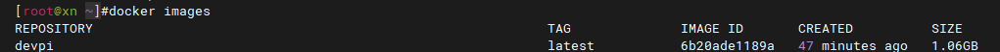
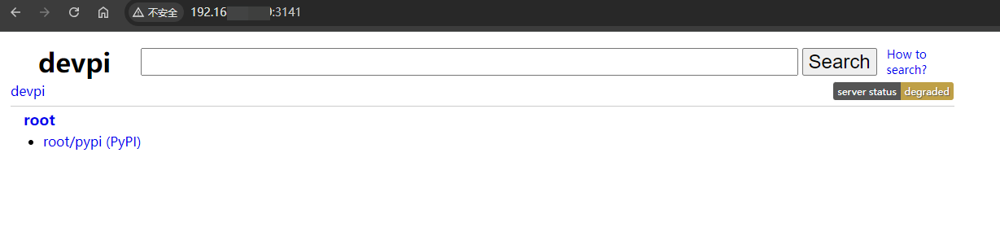

## 原理
`devpi-server` 会定期从上游 PyPI 服务器同步包。
当 `devpi-server` 收到一个来自用户的包请求时，如果该包在本地不存在，它会从上游 PyPI 服务器下载该包并缓存在本地。
这样，下次再有用户请求同一个包时，就可以直接从本地缓存提供，而不需要再从上游 PyPI 服务器下载，从而实现节省带宽、快速下载等目的。

当然，`devpi-server` 也会定期检查上游 PyPI 服务器，以确定是否有新的包版本发布。如果有，它会下载新版本的包并更新本地缓存。

`devpi-server` 的这种同步方式是懒加载（lazy loading）的，即只有在用户请求某个包时，它才会去上游 PyPI 服务器下载。
这样可以节省大量的存储空间，因为 `devpi-server` 只需要存储用户实际请求过的包，而不需要存储 PyPI 服务器上的所有包。

## 创建devpi镜像
使用Python镜像作为基础镜像，安装devpi-server、devpi-client、devpi-web（这里使用了南京大学的镜像源，可自行修改）。
创建配置文件目录，创建配置文件，初始化devpi服务器，暴露3141端口，启动devpi服务器。

```bash

```Dockfile
FROM python:3.8

RUN pip install devpi-server devpi-client devpi-web -i https://mirror.nju.edu.cn/pypi/web/simple

# 创建配置文件目录
RUN mkdir -p /root/.devpi/server/

# 创建配置文件
RUN echo "[server]" >> /root/.devpi/server/server.ini
RUN echo "mirror_cache_expiry = 0" >> /root/.devpi/server/server.ini

# 初始化 devpi 服务器
RUN devpi-init --serverdir /root/.devpi/server/

EXPOSE 3141

ENTRYPOINT ["devpi-server", "--host", "0.0.0.0", "--port", "3141", "--serverdir", "/root/.devpi/server"]
```
创建一个名为`Dockerfile`的文件，将上面的内容复制进去。

构建镜像

```bash
docker build -t devpi .
```

不出意外的话，镜像构建成功，可以使用`docker images`查看。



到这里，devpi镜像已经构建成功，已经完成了80%的工作，接下来就是修改上游同步源。

## 启动devpi容器并修改上游同步源

让容器在后台运行，映射容器的3141端口到宿主机的3141端口，这样我们就可以通过宿主机的3141端口访问devpi服务器。

```bash
docker run -d --name devpi -p 3141:3141 devpi
```

实际上到这里我们就可以使用devpi了，但是因为默认的上游 `https://pypi.org/simple` 访问速度比较感人，这里把上游切换到国内的镜像中（如果你是服务器可以跳过这一步），比如南京大学、清华大学、阿里云、豆瓣的源等。

这里以南京大学的源为例，修改devpi的上游源。

首先进入到docker容器中，这里使用`docker exec`命令。

```bash
docker exec -it devpi bash
```

登录到默认的源，进行配置修改。

```bash
devpi use http://localhost:3141
devpi login root --password=
devpi index root/pypi mirror_url=https://mirror.nju.edu.cn/pypi/web/simple
```

简单解释一下这三行指令：
- `devpi use http://localhost:3141` ：使用devpi服务器
- `devpi login root --password=` ：登录到devpi服务器，密码默认为空
- `devpi index root/pypi mirror_url=https://mirror.nju.edu.cn/pypi/web/simple` ：修改上游源为南京大学的源

这样就完成了修改上游源的操作，可以直接访问`http://localhost:3141/root/pypi` 查看是否修改成功（注意localhost修改为docker容器的ip）。



到这里，我们就完成了使用Docker自建PyPI镜像源已经完成。等待服务同步所有索引之后，就可以愉快的使用了。

## 使用

注意自行将127.0.0.1替换为docker容器的ip地址。

### 临时使用
使用pip安装包时，可以通过`-i`参数指定devpi服务器地址，也可以通过`--extra-index-url`参数指定devpi服务器地址。

这里因为使用的http，所以必须加上`--trusted-host`参数。
```bash
pip install -i http://127.0.0.1:3141/root/pypi requests  --trusted-host 127.0.0.1
```

### 永久使用
可以直接修改pip配置文件，将devpi服务器地址加入到pip的配置文件中。
```bash
pip config set global.index-url http://127.0.0.1:3141/root/pypi/
pip config set global.trusted-host 127.0.0.1
```

初次下载可能速度较慢，第二次下载的时候优先从本地缓存下载，这个速度基本上就完全取决于硬盘读写和内网带宽速度了。