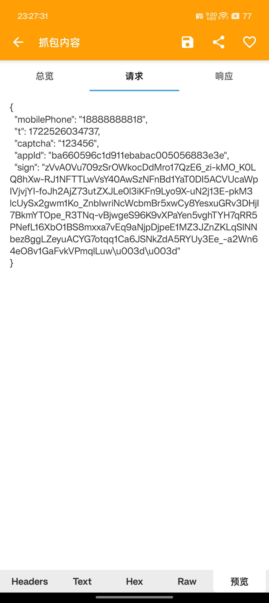
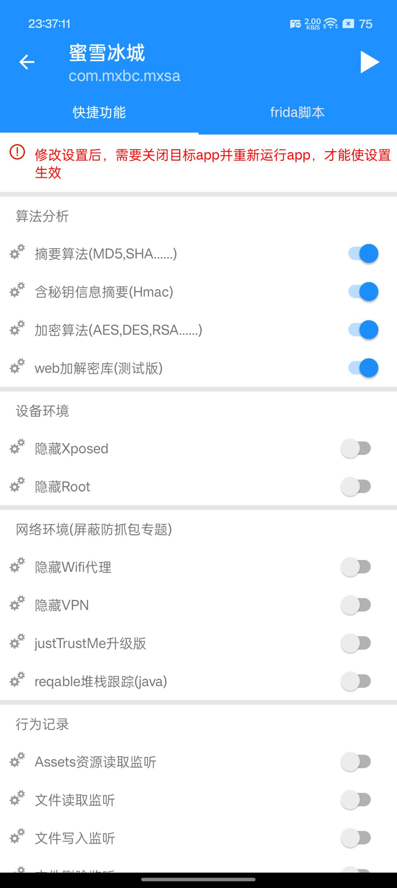
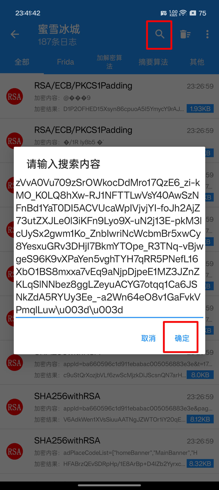
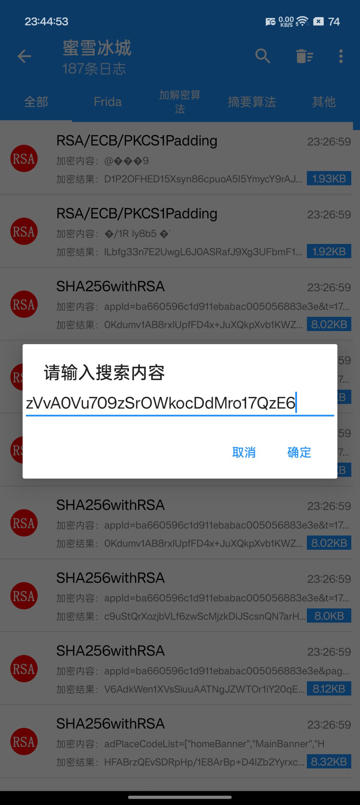
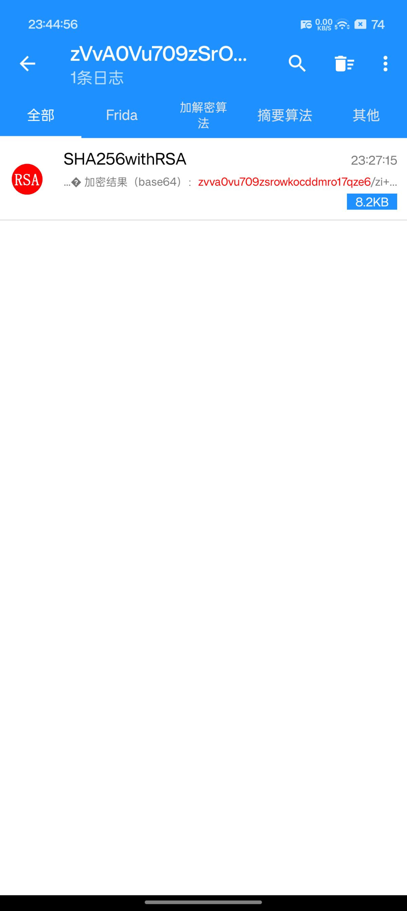
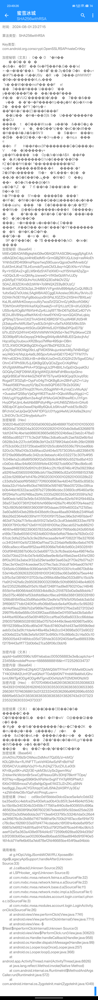
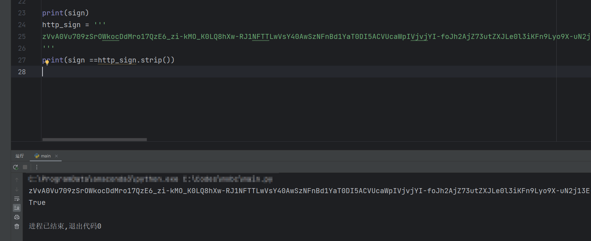

## 前情提要
https://linux.do/t/topic/166202

## 准备工具
工具下载地址在文章最后
1. Android手机（已ROOT，并刷入xp框架，可抓包）
2. 蜜雪冰城APP
3. 算法助手Pro
4. 手

## 暴力提取
开始之前先登录抓包看一下参数，了解清楚我们要做什么
登录账号，并且抓包，得到`app/v1/login`的POST请求看下data数据

```json
{
    "mobilePhone": "18888888818",
    "t": 1722526034737,
    "captcha": "123456",
    "appId": "ba660596c1d911ebabac005056883e3e",
    "sign": "zVvA0Vu709zSrOWkocDdMro17QzE6_zi-kMO_K0LQ8hXw-RJ1NFTTLwVsY40AwSzNFnBd1YaT0DI5ACVUcaWpIVjvjYI-foJh2AjZ73utZXJLe0l3iKFn9Lyo9X-uN2j13E-pkM3lcUySx2gwm1Ko_ZnbIwriNcWcbmBr5xwCy8YesxuGRv3DHjI7BkmYTOpe_R3TNq-vBjwgeS96K9vXPaYen5vghTYH7qRR5PNefL16XbO1BS8mxxa7vEq9aNjpDjpeE1MZ3JZnZKLqSlNNbez8ggLZeyuACYG7otqq1Ca6JSNkZdA5RYUy3Ee_-a2Wn64eO8v1GaFvkVPmqlLuw=="
}
```
从图中可以看到几个参数，并且人类能读懂的有：`mobilePhone`、`t`、`captcha`、`appId`，正常人类读不懂的参数有：`sign`，但是有经验的看一眼就知道这个是类似RSA加密的产物（很像base64），但是，众所周知base64由大小写英文字母（26+26）+数字（10）+“+/”（2）组成，这个字符串，好像并没有“+/”字符，而且，多出来了“-_”字符。先不管这么多了，直接上工具。

打开`算法助手Pro`找到蜜雪冰城APP，勾选`算法分析`下的四个选项，然后退出蜜雪冰城账号，停掉蜜雪冰城APP，打开抓包工具，点击`算法助手Pro`右上角的运行标志：


会自动打开蜜雪冰城APP，这时候登录一遍账号，回到抓包APP中获取当前生成的`sign`参数，复制出来。然后进入`算法助手Pro`APP主界面，点击`日志`tab，进入蜜雪冰城列表，点击右上角的搜索按钮，粘贴刚才获取到的`sign`参数，看下能不能搜索到结果。


不出意外的话，就出意外了。**搜索不到！！！**
怎么办？我问你？
那就搜索部分字符串再试试呗，搜索`sign`参数的前半部分（纯字母数字部分），排除掉其他字符带来的影响。

<table>
  <tr>
    <td></td>
    <td></td>
  </tr>
</table>

不出意外的话，这次应该不会出意外了。成功搜到了结果，赶紧点开看看吧。

全是有效信息啊，先看结果对不对，不对的话，就白分析了。
找到`加密结果（Base64）：`，正下方列出了结果，将其复制然后跟上文抓包获取到的sign对比，发现base64的所有`+`被替换成了`-`，`/`被替换成了`_`，到这就好办了啊，一切都明白了。

往上翻，看`算法类型`、`加密秘钥（Base64）`、`加密文本（文本）：`
我们得到了如下的结果：

| 字段名          | 值                                                                                                                                                                                                                                                                                                                                                                                                                                                                                                                                                                                                                                                                                                                                                                                                                                                                                                                                                                                                                                                                                                                                                                                                                                                                                                                                                                                                                                                                                                                                                                                                                                                                                        |
|--------------|------------------------------------------------------------------------------------------------------------------------------------------------------------------------------------------------------------------------------------------------------------------------------------------------------------------------------------------------------------------------------------------------------------------------------------------------------------------------------------------------------------------------------------------------------------------------------------------------------------------------------------------------------------------------------------------------------------------------------------------------------------------------------------------------------------------------------------------------------------------------------------------------------------------------------------------------------------------------------------------------------------------------------------------------------------------------------------------------------------------------------------------------------------------------------------------------------------------------------------------------------------------------------------------------------------------------------------------------------------------------------------------------------------------------------------------------------------------------------------------------------------------------------------------------------------------------------------------------------------------------------------------------------------------------------------------|
| 算法类型         | SHA256withRSA                                                                                                                                                                                                                                                                                                                                                                                                                                                                                                                                                                                                                                                                                                                                                                                                                                                                                                                                                                                                                                                                                                                                                                                                                                                                                                                                                                                                                                                                                                                                                                                                                                                                            |
| 加密秘钥（Base64） | MIIEvQIBADANBgkqhkiG9w0BAQEFAASCBKcwggSjAgEAAoIBAQDbC4pjJol4HdEkdMS+GrmGBjZl6YJQJLbqI+ssR4oEhYrNhSd3fD4t99msPbpsrfwq590uaxvQgos0wifMvwibO/EuM3mfJKsET8JrEomddTywbCM3Jbq+hQErXNv+VVNseRy+1rtSDAx2+gELM9n6zS1ATldXMD+xzYI5hHaHIZqZjp++bDQs3J6+ocQMAyJzwwe0+VfASeGizW1vUJDypQW5yEYWDGUhvYoUM8DQ3EislNkDVZG/5DAZJ83ZDXm8i2zWW+7o9INQXZEByBOUzC/BnIdGxPL6CSOb2pL2HtBWVVFgmMv8994pllyCoQUfiBU31uItxSaQ7x0UdsL5AgMBAAECggEAAosiwz36UKu/9vVoJ3D2AIln7k0E11tlyFg8bdoyzxSh5PsL10ZZDn2XSHm7BXILwI/KsLRLsWMirK0oeycouWy7wzaTzfZGChnG/ylK8coft0i6K/TDM10mA1PjthNVkafiXpDtwekj5+nFQ1UJzfC9+sYuG3QS+USSo4pXOgBzYfIbYbHhZp4UJqf8T7BnD6Tq0SdCz4D7VhllE2AJ8V8NquxRkeYAKnEn1ew6YKhlQ+sonGQ43fwLqkiqgPSNsjT/Smm7JtI2TmA5HhEXBRD5F1OuyW49FJfd5HRj33skpxfhvNtRUSel7yw83z3rhjM+z5eTkA95EM9tcS5hEQKBgQD6wprKtSGtuGIQRhYeSJGYI5BleDPQoID79/b7trJD2VG24YnHO45lVhIWNNYAGN5d+7ed7Pp5KwwCZ83D36Ilp6PJ4o0eyqqOHk9wgi944ydlbMNBJEEQobcjhAr/HqcsI0q//oubxuvXR2Boyo7MRer49Sqk+DBm57ZLXWDCRQKBgQDfn0goh7BsDF62l3LDz/yOq7SqSYdOWg09cLsjFMDX5NkujunktaH46y7kNB4SgI/wo/A6Or4/MqUp4a6L865jovfz4vsHGiE17D4Q7TFM7t7vPAf+x63DHc336UrtB+dH8kXUwDmI3JOQ3h23V5gwEDAc/OhnC4TlPhS9U5JjJQKBgQDyQCisZjpoCnXqRNs/XFoTgWARNwPPrA+P3GjlmgUz2PHBXLfvGpEhQvpsK5UGOQAyCWjFD9iWUEjk1gWKEjUibYalFdHBiockjxGtnodgIQrBSEaFWxHkkGZN0FWTS7iywlGHk9CpqI3UxybTdcRoga9T3f3Zq8+OypFo04gThQKBgBJm2BhFujXZ+r1Jzy7f4aeX56EPteuzq10/9pZXcdsSQPD837BrZe3G5K/wvfzFyZKC2xTfmqI2t7KvmJ55qgMW+RJ/viqCcvMuApl/+0uaaIwFQ58qrVjeDgH1l63TtauM+0QboWBqzlXggU+CDMr/ugXYpgM8xm3a4vgFdYllAoGAOKB1ewREnJ7rFgmHvpDPjxUjmL4wbNb6BPdtyHRg+oHUN65ZWbntrrDAo6X8EdpOFJpIo0sswENpilBy6QIuILbSKnubPvobE5c8b2DBFchrbCwUpQwQOVAF1DFG/c011ygd4wM/JAXe9a2Ikzm/L3hEOh/3ctC24nyljwbAuxY= |
| 加密文本（文本）     | appId=ba660596c1d911ebabac005056883e3e&captcha=123456&mobilePhone=18888888818&t=1722526034737                                                                                                                                                                                                                                                                                                                                                                                                                                                                                                                                                                                                                                                                                                                                                                                                                                                                                                                                                                                                                                                                                                                                                                                                                                                                                                                                                                                                                                                                                                                                                                                            |


再检查一下加密文本内有没有我们获取不到的值？
- appId：那不就是固定的吗
- captcha：短信验证码
- mobilePhone： 手机号
- t：看起来像是时间戳


并且注意到，这些参数与login的请求data是一样的，所以，请求的时候，要保持一致才行。

## 写代码实现
由于实现方法比较简单，这里就用Python简单做一下。
用到的包：pycryptodome
安装Python软件包
```bash
pip install pycryptodome
```
代码：
```Python
import base64
from Crypto.PublicKey import RSA
from Crypto.Signature import pkcs1_15
from Crypto.Hash import SHA256
app_id = 'ba660596c1d911ebabac005056883e3e'
phone_code = '123456'
phone_number = '18888888818'
time_stamp = '1722526034737'
raw_text = 'appId={}&captcha={}&mobilePhone={}&t={}'.format(app_id, phone_code, phone_number, time_stamp).encode()

base64_key = '''
MIIEvQIBADANBgkqhkiG9w0BAQEFAASCBKcwggSjAgEAAoIBAQDbC4pjJol4HdEkdMS+GrmGBjZl6YJQJLbqI+ssR4oEhYrNhSd3fD4t99msPbpsrfwq590uaxvQgos0wifMvwibO/EuM3mfJKsET8JrEomddTywbCM3Jbq+hQErXNv+VVNseRy+1rtSDAx2+gELM9n6zS1ATldXMD+xzYI5hHaHIZqZjp++bDQs3J6+ocQMAyJzwwe0+VfASeGizW1vUJDypQW5yEYWDGUhvYoUM8DQ3EislNkDVZG/5DAZJ83ZDXm8i2zWW+7o9INQXZEByBOUzC/BnIdGxPL6CSOb2pL2HtBWVVFgmMv8994pllyCoQUfiBU31uItxSaQ7x0UdsL5AgMBAAECggEAAosiwz36UKu/9vVoJ3D2AIln7k0E11tlyFg8bdoyzxSh5PsL10ZZDn2XSHm7BXILwI/KsLRLsWMirK0oeycouWy7wzaTzfZGChnG/ylK8coft0i6K/TDM10mA1PjthNVkafiXpDtwekj5+nFQ1UJzfC9+sYuG3QS+USSo4pXOgBzYfIbYbHhZp4UJqf8T7BnD6Tq0SdCz4D7VhllE2AJ8V8NquxRkeYAKnEn1ew6YKhlQ+sonGQ43fwLqkiqgPSNsjT/Smm7JtI2TmA5HhEXBRD5F1OuyW49FJfd5HRj33skpxfhvNtRUSel7yw83z3rhjM+z5eTkA95EM9tcS5hEQKBgQD6wprKtSGtuGIQRhYeSJGYI5BleDPQoID79/b7trJD2VG24YnHO45lVhIWNNYAGN5d+7ed7Pp5KwwCZ83D36Ilp6PJ4o0eyqqOHk9wgi944ydlbMNBJEEQobcjhAr/HqcsI0q//oubxuvXR2Boyo7MRer49Sqk+DBm57ZLXWDCRQKBgQDfn0goh7BsDF62l3LDz/yOq7SqSYdOWg09cLsjFMDX5NkujunktaH46y7kNB4SgI/wo/A6Or4/MqUp4a6L865jovfz4vsHGiE17D4Q7TFM7t7vPAf+x63DHc336UrtB+dH8kXUwDmI3JOQ3h23V5gwEDAc/OhnC4TlPhS9U5JjJQKBgQDyQCisZjpoCnXqRNs/XFoTgWARNwPPrA+P3GjlmgUz2PHBXLfvGpEhQvpsK5UGOQAyCWjFD9iWUEjk1gWKEjUibYalFdHBiockjxGtnodgIQrBSEaFWxHkkGZN0FWTS7iywlGHk9CpqI3UxybTdcRoga9T3f3Zq8+OypFo04gThQKBgBJm2BhFujXZ+r1Jzy7f4aeX56EPteuzq10/9pZXcdsSQPD837BrZe3G5K/wvfzFyZKC2xTfmqI2t7KvmJ55qgMW+RJ/viqCcvMuApl/+0uaaIwFQ58qrVjeDgH1l63TtauM+0QboWBqzlXggU+CDMr/ugXYpgM8xm3a4vgFdYllAoGAOKB1ewREnJ7rFgmHvpDPjxUjmL4wbNb6BPdtyHRg+oHUN65ZWbntrrDAo6X8EdpOFJpIo0sswENpilBy6QIuILbSKnubPvobE5c8b2DBFchrbCwUpQwQOVAF1DFG/c011ygd4wM/JAXe9a2Ikzm/L3hEOh/3ctC24nyljwbAuxY=
'''
pem_key_bytes = base64.b64decode(base64_key.strip())
private_key = RSA.import_key(pem_key_bytes)

h = SHA256.new(raw_text)
signature = pkcs1_15.new(private_key).sign(h)
signature_base64 = base64.b64encode(signature).decode('utf-8')

sign = signature_base64.replace('+', '-').replace('/', '_')

print(sign)
http_sign = '''
zVvA0Vu709zSrOWkocDdMro17QzE6_zi-kMO_K0LQ8hXw-RJ1NFTTLwVsY40AwSzNFnBd1YaT0DI5ACVUcaWpIVjvjYI-foJh2AjZ73utZXJLe0l3iKFn9Lyo9X-uN2j13E-pkM3lcUySx2gwm1Ko_ZnbIwriNcWcbmBr5xwCy8YesxuGRv3DHjI7BkmYTOpe_R3TNq-vBjwgeS96K9vXPaYen5vghTYH7qRR5PNefL16XbO1BS8mxxa7vEq9aNjpDjpeE1MZ3JZnZKLqSlNNbez8ggLZeyuACYG7otqq1Ca6JSNkZdA5RYUy3Ee_-a2Wn64eO8v1GaFvkVPmqlLuw==
'''
print(sign == http_sign.strip())
```

运行结果：

得到了正确的结果，并且与http请求中的sign是相同的值。

~~好了，大佬们赶紧写脚本让我白嫖蜜雪冰城吧。~~

<font size="6" color="red">警告：纯技术研究，禁止非法用途，如有侵权请私信联系我删除。</font>

<font size="6" color="red">警告：纯技术研究，禁止非法用途，如有侵权请私信联系我删除。</font>

<font size="6" color="red">警告：纯技术研究，禁止非法用途，如有侵权请私信联系我删除。</font>

`算法助手Pro`下载地址：

官方下载地址（123网盘）：https://www.123pan.com/s/7G8aTd-g3T4H.html 提取码:u7Zn

个人分流下载地址（文叔叔）：https://f.ws28.cn/f/eqkm1mmkdpp
