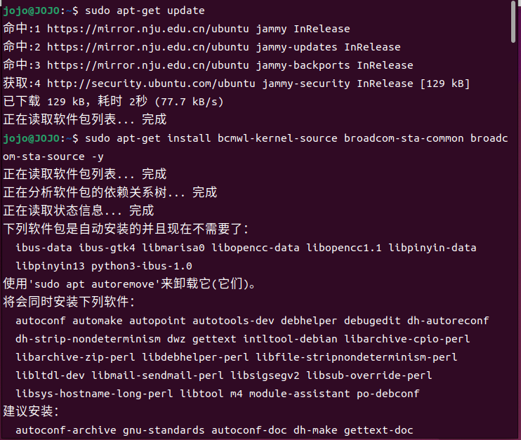

## 安装驱动

首先安装Broadcom 802.11 Linux STA 无线驱动源

```
sudo apt-get update
sudo apt-get install bcmwl-kernel-source broadcom-sta-common broadcom-sta-source -y
```



接着安装Broadcom 43xx 固件提取工具
```
sudo apt install b43-fwcutter firmware-b43-installer -y
```


到这就安装完成了。

## 激活无线网卡
```
sudo modprobe -r b43 ssb
sudo modprobe b43
```
这个时候打开设置就能看到Wi-Fi选项，并且正常搜索到网络了。


