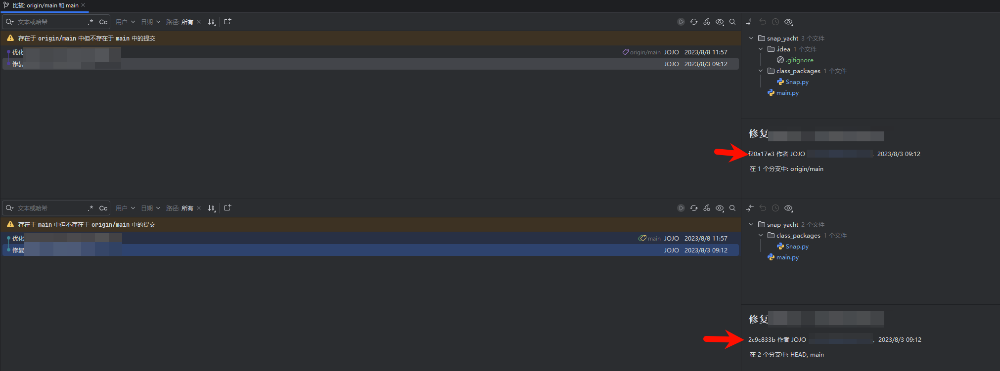

## 废话篇（应用场景介绍）
拉取了一个很久之前的项目（才不是闲置了很久公司又要把它翻出来做的原因呢），发现当时刚入职没多久，规范不是很好，其中包含了`.idea`的目录，这个是使用Jetbrains产生的项目配置文件目录，是不需要提交到仓库中的。
所以就想着优化一下，需求如下：
1. 把历史的提交包含这个目录的全部删掉
2. 保留原始的代码提交树结构

基于这个应用场景，这里就用到了[git-filter-repo](https://github.com/newren/git-filter-repo)工具。

## 安装git-filter-repo
官方给的安装教程在这：https://github.com/newren/git-filter-repo/blob/main/INSTALL.md
这里简单总结一下吧：
- 依赖
  1. git 最低版本 2.22.0，部分[特性功能](https://github.com/newren/git-filter-repo?tab=readme-ov-file#upstream-improvements)需要更高版本。
  2. Python3（含pip工具） 最低版本3.5
- 安装
  
  使用pip工具安装即可：
  ```bash
  pip install git-filter-repo
  ```
  这样就安装完成，可以使用了。

## 使用

`git-filter-repo`的用法比较多，这里只针对当前应用场景进行记录
因为我们需要对所有的历史提交做修改，所以需要在项目根目录执行以下指令，修改历史中所有包含`.idea`的提交。
```bash
git filter-repo --path .idea --invert-paths
```
建议在git clone之后就执行这个，因为如果本地产生了修改，暂存区的文件未提交到git，则执行时会报错，当然也可以先把修改提交后再执行。

到这里就已经成功了，我们现在对比一下远程仓库和本地仓库：
<table>
  <thead>
    <tr>
      <th>远程历史记录</th>
      <th>本地历史记录</th>
    </tr>
  </thead>
  <tbody>
    <tr>
      <td>
        
      </td>
      <td>
        
      </td>
    </tr>
  </tbody>
</table>



从结果上看，它会把包含`.idea`目录的提交修改，并且会把这个提交之后的提交全都修改了。保留了commit结构树、提交时间、提交作者等信息。

现在本地分支已经没有`.idea`目录了。我们只需要将本地提交到远程分支就行，记得将保护分支解锁（虽然这不是一个良好的行为）。

另外执行完上面的指令后，Git远程也被删除了，需要重新添加git远程后再提交：
```bash
git remote add origin https://xxxxxx.git  # 自行修改远程地址
git fetch origin
git push origin refs/heads/main:main --force
```

执行后远程就能看到最新的代码了~