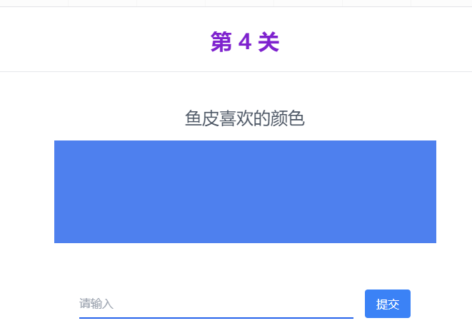
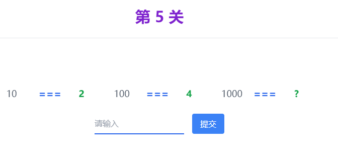
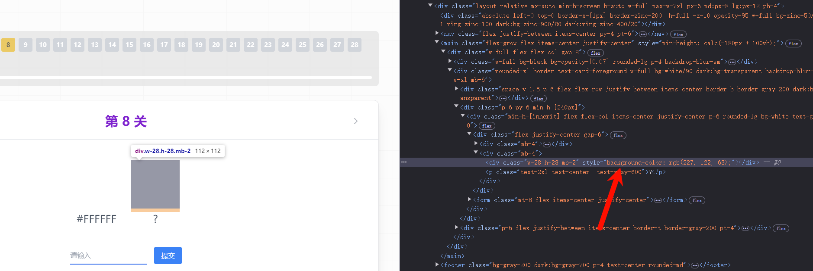
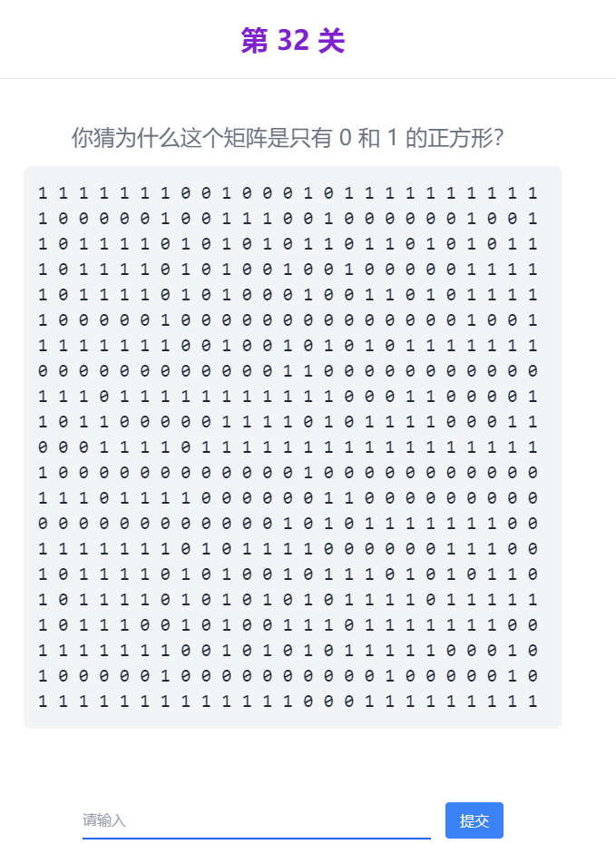

## 前言
本次题目从公众号看到的，抽空就做了一下。
没有广告嫌疑，只是单纯的想解题，鉴于这些题目的答案中包含大量的网站引流信息，此分析的大部分内容不提供答案，或只提供截图答案。
题目地址：[https://1024.codefather.cn/](https://1024.codefather.cn/)

## 解题思路
### 第1题


```text
72 101 108 108 111
87 111 114 108 100
```

看到数字，想到什么。还是100左右的数字，那第一反应肯定是ASCII码。

背一下 `72` 的 ASCII 码是 `H`。等等？`最熟悉，也最陌生`!

这不会就是 `Hello World` 吧。看下数字数量，5+5，不用想了肯定是 `Hello World`。

（不会真有人挨着计算每个字母的 ASCII 码吧？）

就这？上点强度啊。

### 第2题


原谅我这关没加载出来图片，我还以为真上强度了呢，哈哈哈哈哈。

看到图片我就懂了，这不就是CV键盘吗，我也有图。


所以，答案就是 `CV`。

### 第3题


下次这种题直接放在第一题吧，真的提示全给了。

这题URL中有个参数：https://1024.codefather.cn/q/514cf185?answer=codefather

answer=codefather，那答案就是 `codefather`。

### 第4题


鱼皮喜欢的颜色？

虽然我知道这是蓝色，但是这题的答案肯定不是 `blue` 或 `蓝色`。

第一反应是，F12看看有没有线索。


不会是这个rgb吧，直接复制粘贴试试。

（补充一句，到这一关之后，就没关过F12，因为我发现了不得了的东西，见下图）


至此，每道题应该能够得到了一个比较完美的提示，大大降低难度。

### 第5题


```
10 === 2
100 === 4
1000 === ?
```

这题直接秒了，一眼二进制，所以 `1000 === 8`。

### 第6题


这题不是老梗图了吗，`Php是最好的语言`。

但是我想说，大人，时代已经过去了。同样是P语言，我认为 `Python是最好的语言`。（虽然我知道这个是Php官方玩梗）

### 第7题


对，这题确实没有提示。

但是我想科普一下：1Byte = 8bit。

另外，额外科普一下，区分字节(Byte)和位(bit)的关键在于大小写。

问：64MBps 和 8Mbps 哪个速度更快呢？

### 第8题


又是颜色题？F12直接查，秒了。



等等，这是RGB，还得转换？太麻烦了，我选择直接调出取色器（嘿嘿嘿）。


`#E37A3F`秒了。

### 第9题

好巧，今天是1024，今天又是星期四。

另外这个数字（1729563911）看着怎么那么像时间戳？

转换一下看看：2024-10-22 10:25:11。这是出题时间？


意思是，给出周四的时间戳就是答案呗，刚好今天是周四，直接复制页面上的时间戳吧。

### 第10题


看到题目 `"分量"`，我第一反应以为中分藏了什么东西呢，要上PS调色？太麻烦了，先看看F12能不能调出东西吧。
```html
<p class="mb-4 text-2xl text-center text-gray-600">可惜你不是程序员，也不懂这张图的 "分量"</p>
<div class="h-auto"></div>
```
看到的关键词只有：`xiaoheizi`、`有趣的梗图`、`w-[110%]`。

我以为答案可能是：`小黑子`、`有趣的梗图`、`110%`。

可惜都不是。

再回到题目描述，`分量`，重点聚焦在`量`字上。跟图片有关的`量`？

分辨率？ 看了下图片的分辨率，是 `204x192`。也不是正确答案。

那关于图片的`量`，还有什么呢？哦？！文件大小！

下载下来看字节大小：9128字节，终于结束了。


### 第11题


又是颜色？秒了。

算了，还是解释一下吧，这个数值一眼就是颜色的RGB值。
```
黑色 = 0,0,0
白色 = 255,255,255
红色 = 255,0,0
```
已经背了这些，实在不知道，去搜一下。

### 第12题

好明显的蒙版，但是，好像没蒙全（bushi）

看下F12


就是它了（看左边的大小与图片大小不一样的蒙版），直接删掉（Del键）！


好的，答案出来了。

### 第13题


看图识字，小学题，曲奇饼干（Cookie）

意思是让我看看浏览器的Cookie，F12，Application，Cookies，看看有没有线索。


看不见看不见，真的看不见，那就直接复制吧。

### 第14题


这题属实没看明白想表达什么，我还以为让我修改代码，让这个加载动画停止呢。不过鉴于难度略大，暂时没尝试。

看下提示：


Restart？懂了，原来是想表示，出现问题，重启就能解决。

那就刷新一下网页，通关。

### 第15题


就一个 `Debug`。看来这题想表达的是让我看下console的输出？或者让我下断点调试？

鉴于暂时不知道断点下在哪，就先看下console吧。

看到了一个不同寻常的错误：


点进代码看看：


```javascript
console['error'](_0x4c0024(0x9ca));
```
像是故意抛出的错误，难道是这个错误字符串？`connection error`试试？

### 第16题


由于上一关停在了console界面，所以进入这一关的时候就在console界面看到了提示。

那就直接输出这两个变量吧。


好，答案来了：`\x00`

### 第17题


直接点击按钮，下载后是一个txt文本，打开看看。


虽然乱码，但是很容易看到关键的头文件，依据经验，这是个PNG文件。那就直接改后缀看答案吧。

答案是`ctrl`，就不贴图了。

### 第18题


没注释？那就是让我看注释，直接F12启动。


这是什么？直接复制粘贴，结束。

### 第19题


图片不显示？那肯定代码有问题，看代码：


直接把上面的文本拼接到`data:image/jpeg;base64,`后面，图片就显示了。

很简单。


### 第20题


这题跟上一题一样，都是资源不显示（图片、音频）。

同理，看代码。一般音频都是MP3，改下后缀试试。可行。

但是我在公司摸鱼，不能开声音播放这个吧。

那就结合其他信息：音频时长2秒；文件名为：kunkun.mp3；上一题的答案是`ji`。

那这题的答案大概率是`鸡`、`ji`、`鸡你太美`之类的，直接猜答案吧。

最后，答案是`ji`（好像`鸡`也对）。

### 第21题


对啊，答案已经给我过了。

### 第22题


这题从代码中就能看出，答案肯定在Base64上。

但是Base64就是图片啊，能有什么额外的信息吗？难道答案是这串Base64？

复制试试：

我？！
进Network看看：

好，直接复制。

### 第23题


一眼Unicode码的字符，那就直接算一下`美`的Unicode码是什么。


复制粘贴，结束。

### 第24题


你又看不见什么了啊？！哦，又藏东西了。

### 第25题


第一眼，既然小的数字，等于大的数字，那肯定是进制转换，并且是高进制往低进制转换。

根据经验，先试下16进制转10进制。


结束，答案是`4132`。

### 第26题


点一下会有请求，但是请求失败？

请求地址为`/1024_status_code`，所以这题考查的是状态码。

`404` 秒了。

### 第27题


这题一眼就看出来是分析复杂度。

我如果是个大学生，我就开始分析了，可是我现在不是大学生。

那我就直接从5开始试（因为第二段代码是5），所以答案是`8`。

### 第28题


这题说实话，我真不会。

但是，程序员另一个必备技能就是：搜索。


看到第一个中文网页，跟计算机相关，点开看看吧。


好，答案又有了。

### 第29题


好家伙，又藏了。

### 第30题


```
coder_yupi + mysecretis123456 => ArocnwrBiWMQVw== 
 ? + mysecretis654321 => ntPc4wO4v/Y=
```
文本 + secretis => Base64

那说明`coder_yupi`被加密的文本，`mysecretis123456`是加密密钥，得到的结果是`ArocnwrBiWMQVw==`。

由于没有公私钥的概念，所以，肯定是对称加密。

那就去挨着尝试是哪种加密算法吧。


经过一番尝试，是RC4加密，那就按照这个解密一下第二个的原文本。


`you_good`

### 第31题


既然图片里藏着二维码，那就下载下来看看。

文件名为：`hideQrcode-DCIkxdZo.jpg`。很敏感的jpg，感觉像是压缩包，改下后缀试试（这里有个小知识，jpg文件可以藏压缩包，就不科普了）。


扫码之后得到答案：


### 第32题

```
1111111001000101111111111
1000001001110010000001001
1011110101010110110101011
1011110101001001000001111
1011110101000100110101111
1000001000000000000001001
1111111001001010101111111
0000000000001100000000000
1110111111111110001100001
1011000001111010111100011
0001111011111111111111111
1000000000000100000000000
1110111100000011000000000
0000000000001010111111100
1111111010111100000011100
1011110101001011101010110
1011110101010101111011111
1011100101001110111111100
1111111001010101111100010
1000001000000000010000010
1111111111111000111111111
```
这题卡了我很久，真的服了。

鉴于上题的经验，立马就想到了这题是二维码。所以，需要将1 0转换成黑白块，然后扫码。

代码如下：
```python
import numpy as np
import matplotlib.pyplot as plt

# 二维码数据
data = '''1111111001000101111111111
1000001001110010000001001
1011110101010110110101011
1011110101001001000001111
1011110101000100110101111
1000001000000000000001001
1111111001001010101111111
0000000000001100000000000
1110111111111110001100001
1011000001111010111100011
0001111011111111111111111
1000000000000100000000000
1110111100000011000000000
0000000000001010111111100
1111111010111100000011100
1011110101001011101010110
1011110101010101111011111
1011100101001110111111100
1111111001010101111100010
1000001000000000010000010
1111111111111000111111111'''

data = data.split('\n')

# 转换为numpy数组
qr_array = np.array([[0 if char == '1' else 1 for char in row] for row in data])

# 绘制二维码
plt.imshow(qr_array, cmap='gray', interpolation='nearest')
plt.axis('off')  # 不显示坐标轴
plt.show()
```

我以为要得到答案了，你也以为是吧？


这是啥？又像又不像？

到这里线索就完全断了，我怀疑是出错题了。

然后就只有另外一个方法，调试js，看下这题答案是啥。但是这不是太暴力了吗？而且很费时。

翻下评论，找到了答案，先拿走吧，后面再研究：`yupi_thanks_you`。

这里补充一下后面根据答案反推的过程：

首先，已知答案，然后生成二维码，然后转换成10矩阵，对比矩阵差异。

但是二维码具有容错性和版本，不同的参数，生成的二维码是不一样的。这里只是碰碰运气，没想到生成了一张比较像的：


用代码将二维码转换成10矩阵，然后对比：

```python
import cv2


def qr_image_to_matrix(image_path):
    # 读取二维码图像
    image = cv2.imread(image_path)

    # 创建QRCodeDetector对象
    detector = cv2.QRCodeDetector()

    # 检测并解码二维码，返回二维码的内容、矩形坐标和二值化二维码图像
    data, points, qr_code_image = detector.detectAndDecode(image)

    if qr_code_image is not None:
        # 将二维码图像转为二值矩阵（0 和 1 的形式）
        _, binary_qr = cv2.threshold(qr_code_image, 127, 1, cv2.THRESH_BINARY)

        # 反转矩阵中的 0 和 1
        inverted_qr_matrix = 1 - binary_qr

        return inverted_qr_matrix
    else:
        print("未检测到二维码")
        return None


image_path = 'img.png'  # 替换为你的二维码图片路径
matrix = qr_image_to_matrix(image_path)

if matrix is not None:
    # 打印反转后的二维码矩阵
    for row in matrix:
        print(''.join(str(int(i)) for i in row))
```


拿两个矩阵对比：


对比结果发现，两矩阵相似度很高，然后这题就这样了，我也不知道具体怎么解，就这样吧。

### 第33题


又是图片，估计又藏了什么东西，下载出来记事本打开看看吧。


一堆乱码中藏着明文，直接复制粘贴。

### 第34题


既然移动不了页面的元素，那就让整个页面都变成海洋吧。


好了，终于结束了。